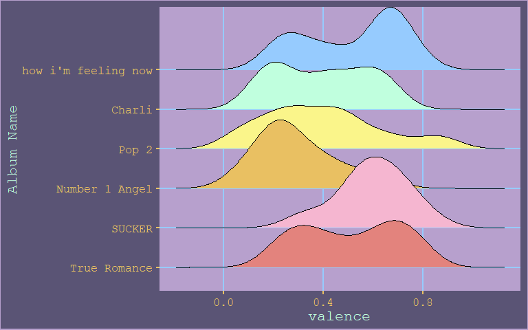

Spotify Visualisation
================
Grace Heron
29/07/2020

Using the ‘spotifyr’\[<https://github.com/charlie86/spotifyr>\]. Is a
neat R wrapper for Spotify’s Web API

## Charli XCX Visualisation

I went/still going through a charli xcx phase.

## Grimes Visualisation

I did my main project for MXB262 on Grimes. Can’t wait for their break
up album (bye bye elon rat).

### Why?

  - I have listened to most of Grimes’s discography
  - I want to justify my opinions
  - Grime’s is known for ‘edgy’ music but is it really?

### Visualisation 1:

<!-- -->

### Visualisation 2:

<!-- -->

### Visualisation 3:

<!-- -->
