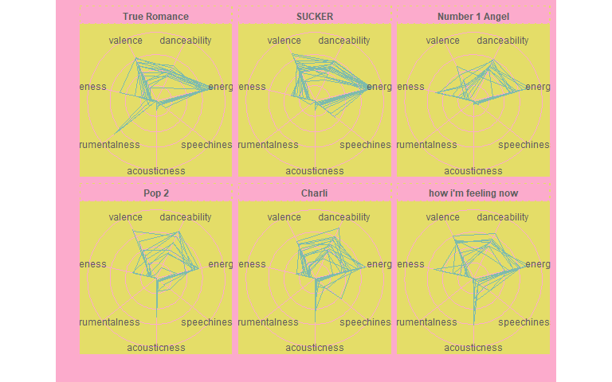

Spotify Visualisation
================
Grace Heron
29/07/2020

Using the ‘spotifyr’\[<https://github.com/charlie86/spotifyr>\]. Is a
neat R wrapper for Spotify’s Web API

## Charli XCX Visualisation

For fun I made some cute viz for Charli’s music. Valence is a measure of
‘happiness’, ironic as the ‘how i’m feeling now’ album was written and
produced during the 2020 pandemic. Maybe it is all about the balance of
happy/sad.

<!-- -->

Cutesy polar plots of the albums. It’s kind of a fingerprint of each
album. Pop 2, Charli and how i’m feeling now are more similar to each
other than Charli’s first three albums.

<!-- -->

## Grimes Visualisation

I did my main project for MXB262 on Grimes.

### Why?

-   I have listened to all of Grimes’s discography
-   I want to justify my opinions
-   Grime’s is known for ‘edgy’ music but is it really?

### Visualisation 1:

<!-- -->

### Visualisation 2:

<!-- -->

### Visualisation 3:

<!-- -->
